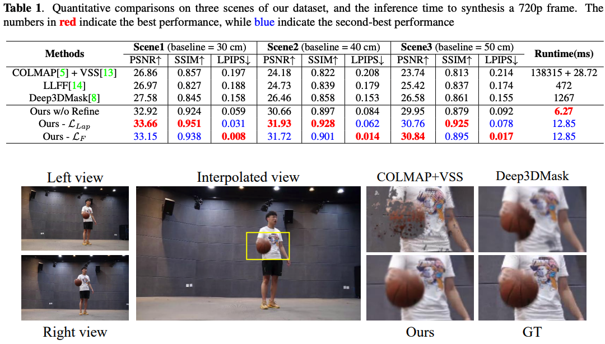

# Real-Time View Interpolation Network(VINet)


[](https://arxiv.org/abs/2112.10603)
[](https://openaccess.thecvf.com/content/ICCV2021/papers/Sim_XVFI_eXtreme_Video_Frame_Interpolation_ICCV_2021_paper.pdf)
<!-- [](https://github.com/JihyongOh/XVFI) -->
<!-- [](https://www.youtube.com/watch?v=5qAiffYFJh8&ab_channel=VICLabKAIST) -->

This is the official repository of VINet module in "A Multi-user Oriented Live Free-viewpoint Video Streaming System Based On View Interpolation" (ICME 2022)

\[[ArXiv](https://arxiv.org/abs/2112.10603)\] | \[[Demo]()\]


## Installation
```bash
git clone https://github.com/Eric-chuan/VINet
cd VINet
conda env create -f environments.yml
conda activate VINet
```
## Usage
### interpolate the intermidate view bettween two view
1. organize your multi-view image folder **\<img_dir\>** as follow
    ```
    ├──── IMG_DIR/
        ├──── 00.png
        ├──── 01.png
        ├──── ...
        ├──── 11.png
    ```
2. run the script
    ```bash
    python inference.py --img_dir image_folder --out_dir output_folder --exp=1 --gpu_idx=0
    ``` 
3. output 
    ```
    ├──── OUT_DIR/
        ├──── 00.png
            ├──── inter_view1.png
        ├──── 01.png
        ├──── ...
        ├──── 10.png
            ├──── inter_view10.png
        ├──── 11.png
    ```
4. you can increase the `--exp` to get a more intensive viewpoint
## Custom dataset
1. prepare your own multi-view synchronized video
2. organize your own multi-view synchronized video as follow
    ```
    ├──── YOUR_DIR/
        ├──── raw_videos/
            ├──── 00.mp4
            ├──── ...
            ├──── 11.mp4
    ```
3. convert your video to frames
    ```bash
    python extract_videos.py
    ```
4. organise your frames into triplets and compress them into npz format
5. It looks so cumbersome, but fortunately you can perform the above operation using the script provided
    ```bash
    python process-vimeo90k.py
    ```
## Train
1. Run **main.py** with the following options in parse_args: 
    ```bash
    python -m torch.distributed.launch --nproc_per_node=2 train.py --world_size=2  --epoch=100 --batch_size=32
    ```
## Results

## Citation
```bib
@article{hu2021multi,
  title={A Multi-user Oriented Live Free-viewpoint Video Streaming System Based On View Interpolation},
  author={Hu, Jingchuan and Guo, Shuai and Dong, Yu and Zhou, Kai and Xu, Jun and Song, Li},
  journal={arXiv preprint arXiv:2112.10603},
  year={2021}
}
```